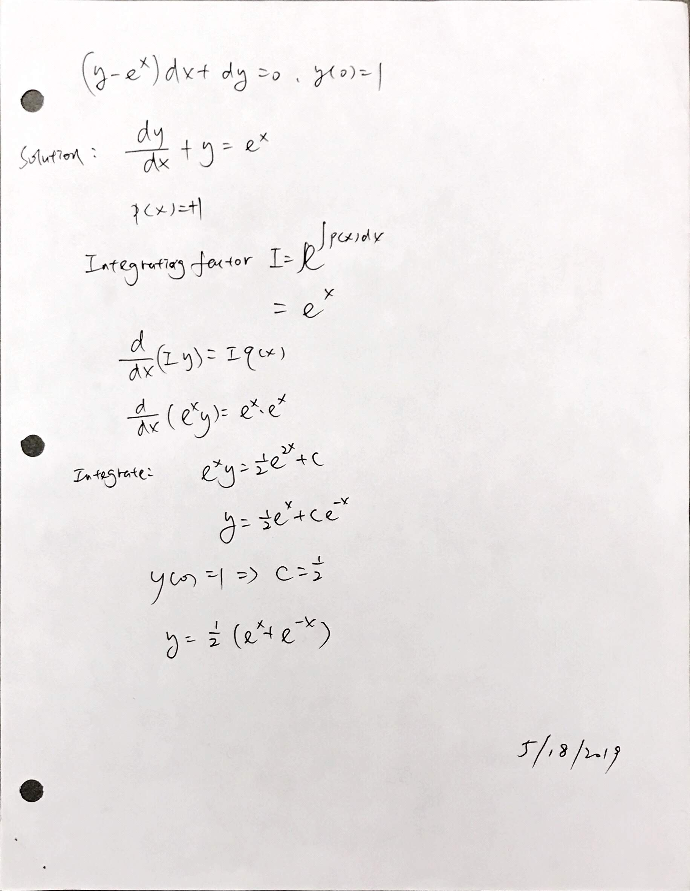

### 1.6 First Order Linear Differential Equations

A differential equation that can be written in the form
$$
\begin{aligned}
\tag{1.6.1} a(x)\frac{dy}{dx} + b(x)y = r(x)
\end{aligned}
$$
where $a(x), b(x)$, and $c(x)$ are functions defined on an interval $(a, b)$ is called a **first-order linear differential equation**.
We assume that $a(x) \ne 0$, and divide both sides of $(1.6.1)$ by $a(x)$ to obtain the **standard form**
$$
\begin{aligned}
\tag{1.6.2}\frac{dy}{dx} + p(x)y = q(x)
\end{aligned}
$$

**Integrating Factor**
The function $I = e^{\int p(x)dx}$ is called an integrating factor.

#### Homework
1.6 p.59 1-19 odd (#19-see my answer)

