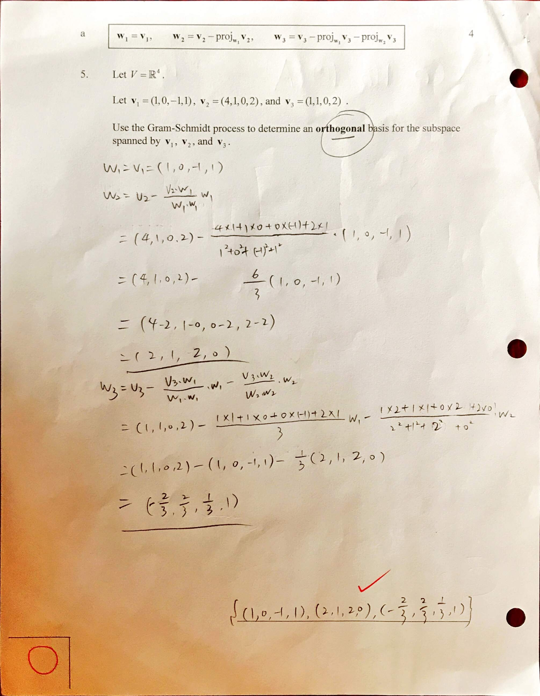

### 5.3 The Gram-Schmidt Process

**The Gram-Schmidt Process**
(1) Let $B = \{v_1, v_2, v_3\}$ a basis for an inner product space $V$. Scale the $v_i's$ if desired.
(2) Let $B' = \{w_1, w_2, w_3\}$ where
$$
\begin{aligned}
w_1 &= v_1\\
w_2 &= v_2 - \text{proj}_{w_1}v_2 \\
&= v_2 - \frac{\la v_2, w_1 \ra}{\la w_1, w_1 \ra}w_1\\
w_3 &= v_3 - \text{proj}_{w_1}v_3 \text{proj}_{w_2}v_3\\
&= v_3 - \frac{\la v_3, w_1 \ra}{\la w_1, w_1 \ra}w_1 - \frac{\la v_3, w_2 \ra}{\la w_2, w_2 \ra}w_2
\end{aligned}
$$
Then $B'$ is an orthogonal basis for $V$. Scale the $w_i's$ if desired.
(3) Let $B'' = \{u_1, u_2, u_3\}$ where $u_i = \dfrac{w_i}{||w_i||}$. Then $B''$ is an orthonormal basis for $V$.

#### Homework
p.365 1-13 odd, 17-21 odd, 22-24 all

1-10\. Use the Gram-Schmidt Process to determine an orthonormal basis for the subspace of $\R^n$ spanned by the given set of vectors.
1\. $\{(1, 2, 3), (6, -3, 0)\}$
>Solution
$$
\begin{aligned}
w_1 &= (1, 2, 3)\\
w_2 &= v_2 - \frac{\la v_2, w_1 \ra}{\la w_1, w_1 \ra} w_1\\
&= (6, -3, 0) - \frac{1\times 6 + 2\times (-3) + 3\times 0}{1^2 + 2^2 + 3^2} (1, 2, 3)\\
&= (6, -3, 0)
\end{aligned}
$$
An orthogonal basis is $\{w_1, w_2\}$, or $\{(1, 2, 3), (6, -3, 0)\}$. By normalizing the orthogonal basis, an orthonormal basis of the subspace can be obtained,
$$
\begin{aligned}
\{ \frac{1}{\sqrt{14}}(1, 2, 3), \frac{1}{\sqrt{5}}(2, -1, 0)\}
\end{aligned}
$$

7\. $\{(1, 0, -1, 0), (1, 1, -1, 0), (-1, 1, 0, 1)\}$
>Solution
$$
\begin{aligned}
w_1 &= (1, 0, -1, 0)\\
w_2 &= v_2 - \frac{\la v_2, w_1 \ra}{\la w_1, w_1 \ra} w_1\\
&= (1, 1, -1, 0) - \frac{2}{2}(1, 0, -1, 0)\\
&= (0, 1, 0, 0)\\
w_3&= v_3 - \frac{\la v_3, w_1 \ra}{\la w_1, w_1 \ra}w_1 - \frac{\la v_3, w_2 \ra}{\la w_2, w_2 \ra}w_2\\
&= (-1, 1, 0, 1)
\end{aligned}
$$
