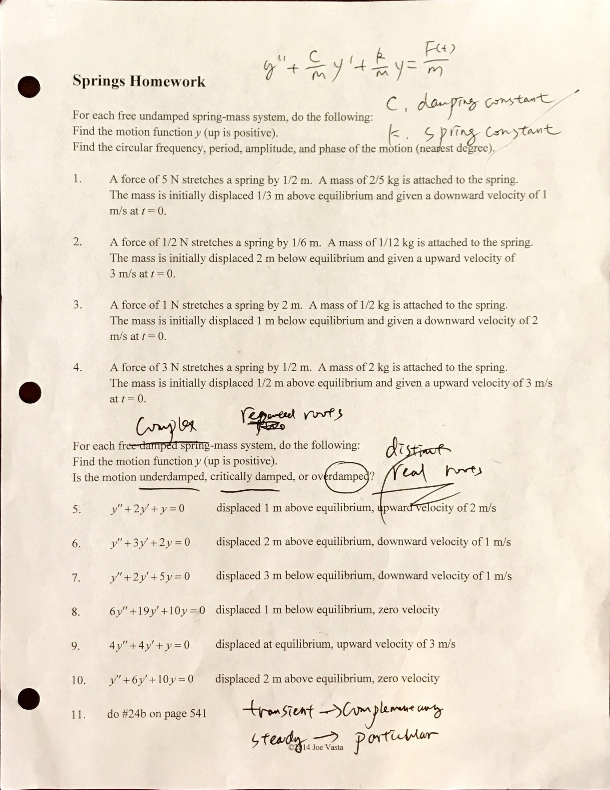
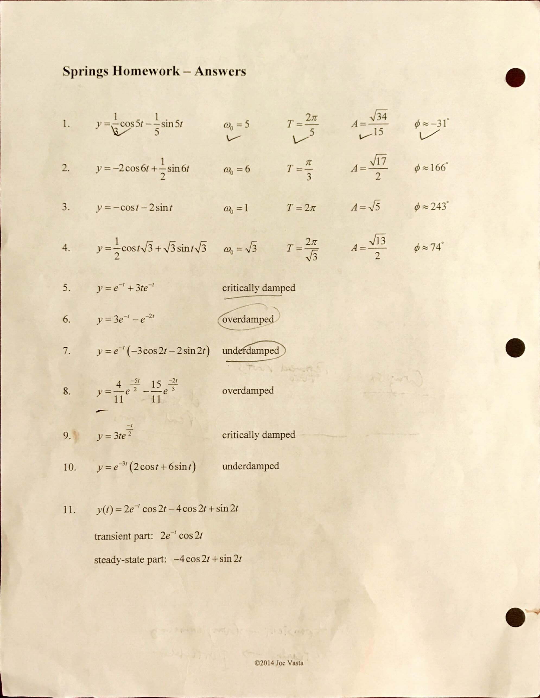
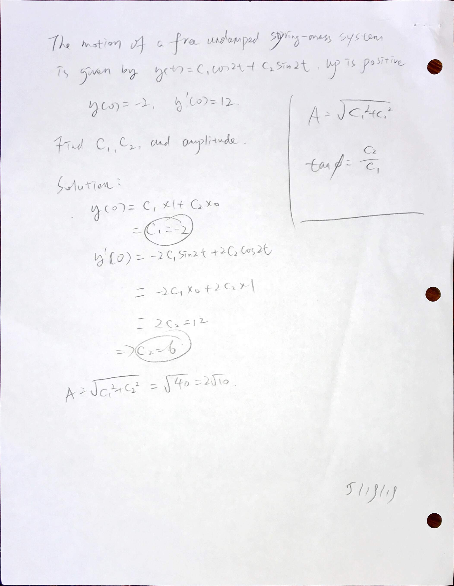

### 0805 Springs

$$
\begin{aligned}
y'' + \frac{c}{m} y' + \frac{k}{m}y = \frac{F(t)}{m}
\end{aligned}
$$
+ $y$ - Displacement. ($y''$ - acceleration, $y'$ - velocity)
+ $c$ - Damping constant (in undamped condition, $c=0$)
+ $k$ - Spring constant
+ $m$ - Mass of object

**Angular Frequency** - $\d \omega_0 = \sqrt{\frac{k}{m}}$

**Period** - $\d T = \frac{2\pi}{\omega_0} = 2\pi \sqrt{\frac{m}{k}}$

#### Homework
8.5 handout 1-11 all

