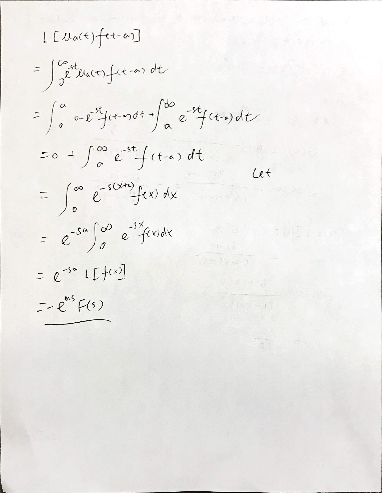
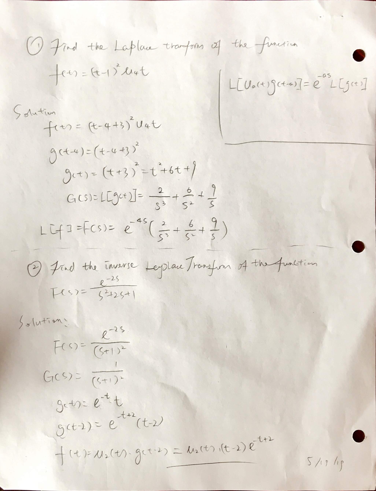
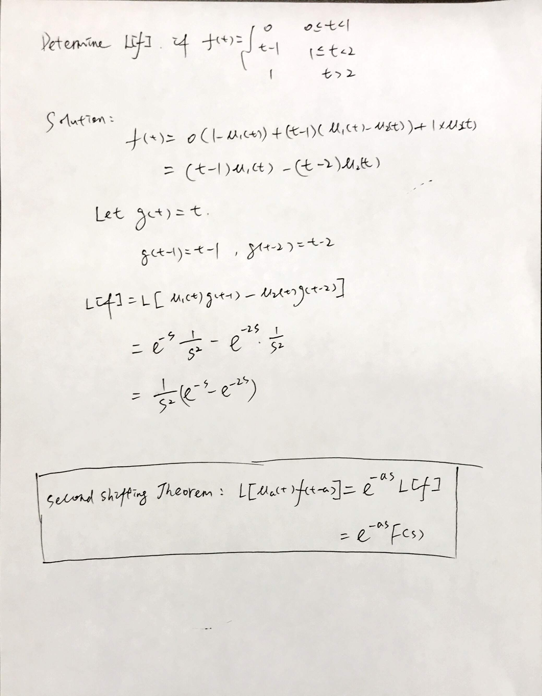

### 1007 The Second Shifting Theorem

$$
\begin{aligned}
L[u_a(t) g(t-a)] &= e^{-as} L[g(t)]\\
&= e^{-as} G(s)\\
\end{aligned}
$$

#### Homework
10.7 p.704 1-41 odd, 42-45 all (#45-book answer wrong)

